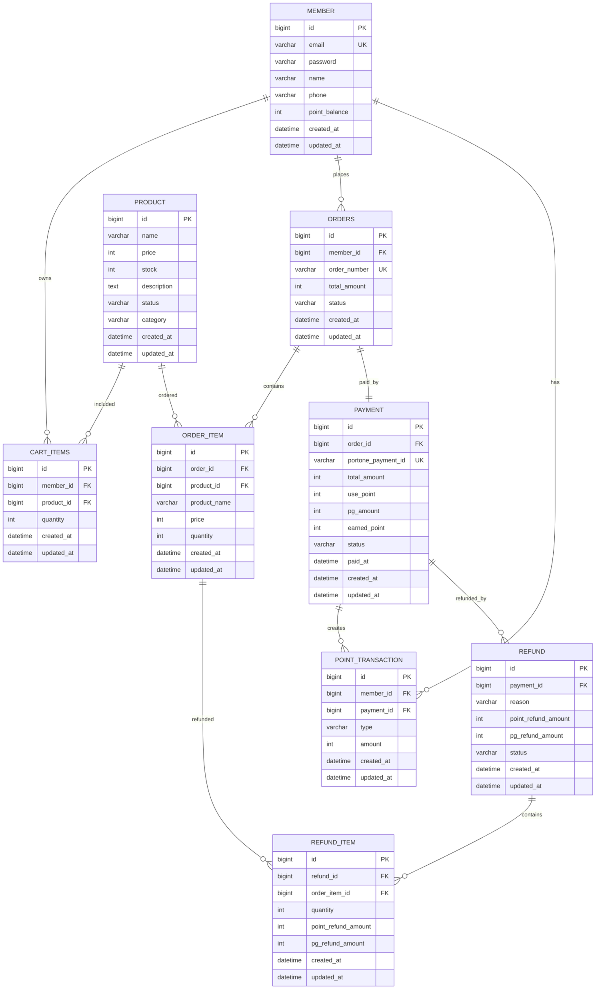

# 📝 PaymentSystemProject

Spring Boot 기반의 커머스 결제 시스템입니다.
회원 인증, 상품 조회, 장바구니, 주문, PortOne 결제 검증, 포인트 적립/사용, 결제 취소 및 부분 환불, PortOne 웹훅 처리를 제공합니다.

## 📌 프로젝트 소개

### 목표

- 실제 결제 연동 흐름을 고려한 주문/결제 백엔드 API 구현
- JWT 기반 인증으로 회원별 장바구니, 주문, 포인트 데이터 보호
- PortOne 결제 검증 및 웹훅 수신을 통한 결제 상태 정합성 확보
- 포인트 사용, 적립, 환불 정산까지 포함한 결제 도메인 모델링
- AWS 기반 Docker 배포 파이프라인 구성

### 핵심 기능

- **회원 인증**
    - 회원가입 및 로그인
    - JWT 기반 인증 처리

- **상품**
    - 상품 목록 조회
    - 상품 단건 조회

- **장바구니**
    - 상품 담기
    - 장바구니 조회
    - 상품 수량 변경
    - 상품 개별 삭제
    - 장바구니 전체 비우기

- **주문**
    - 주문서 미리보기
    - 주문 생성
    - 내 주문 내역 조회
    - 주문 상세 조회
    - 주문 취소

- **포인트**
    - 포인트 잔액 조회
    - 포인트 거래 내역 조회

- **결제**
    - 주문/결제 동시 생성
    - 결제 확정
    - PortOne 웹훅 수신

- **환불**
    - 주문 상품 환불 요청

- **배포**
    - AWS 기반 배포
    - EC2, RDS, ACM, ALB, GitHub Actions 활용

## 🛠️ 기술 스택

| 구분          | 기술                                                               |
|-------------|------------------------------------------------------------------|
| Language    | Java 17                                                          |
| Framework   | Spring Boot 4.0.6                                                |
| Web         | Spring Web MVC                                                   |
| Persistence | Spring Data JPA, Hibernate                                       |
| Database    | MySQL, H2(Test)                                                  |
| Security    | Spring Security, JWT, BCrypt                                     |
| Validation  | Jakarta Validation                                               |
| Payment     | PortOne Server SDK 0.23.0, PortOne Browser SDK                   |
| Infra       | Docker, AWS ECR, EC2 Auto Scaling Group, AWS SSM Parameter Store |
| CI/CD       | GitHub Actions                                                   |
| Build       | Gradle                                                           |
| Test        | JUnit Platform, Spring Boot Test                                 |
| Utilities   | Lombok, Spring Boot Actuator                                     |

## 👥 팀원 소개

| 이름  | 담당 영역              | GitHub                          |
|-----|--------------------|---------------------------------|
| 고수경 | 회원 / 인증 / 인프라 / 배포 | https://github.com/kolyn092     |
| 김유하 | 결제 / 웹훅            | https://github.com/devdong1231  |
| 정예진 | 주문                 | https://github.com/yxejxnn      |
| 이찬서 | 상품 / 장바구니          | https://github.com/mavubsa3-dev |
| 임선구 | 포인트 / 환불           | https://github.com/IMSUN9       |

## 🚀 개발 환경 설정

### 필수 요구사항

- JDK 17
- Gradle Wrapper
- MySQL 8.x
- PortOne 테스트 계정 및 채널 설정

### 환경 변수

| 변수명                      | 기본값         | 설명                     |
|--------------------------|-------------|------------------------|
| `SPRING_PROFILES_ACTIVE` | `local`     | 활성 프로필                 |
| `DB_HOST`                | `localhost` | MySQL 호스트              |
| `DB_PORT`                | `3306`      | MySQL 포트               |
| `DB_NAME`                | `paymentdb` | 데이터베이스명                |
| `DB_USER`                | `root`      | DB 사용자                 |
| `DB_PASSWORD`            | `password`  | DB 비밀번호                |
| `DDL_AUTO`               | `none`      | Hibernate DDL 전략       |
| `JWT_SECRET`             | 개발용 기본값     | JWT 서명 키               |
| `JWT_EXPIRE_TIME`        | `3600000`   | JWT 만료 시간(ms)          |
| `BCRYPT_STRENGTH`        | `10`        | BCrypt 강도              |
| `PORTONE_API_SECRET`     | 없음          | PortOne API Secret     |
| `PORTONE_STORE_ID`       | 없음          | PortOne Store ID       |
| `PORTONE_CHANNEL_KEY`    | 없음          | PortOne Channel Key    |
| `PORTONE_WEBHOOK_SECRET` | 없음          | PortOne Webhook Secret |

### 로컬 실행

```bash
./gradlew bootRun
.\gradlew.bat bootRun
```

### 테스트

```bash
./gradlew test
.\gradlew.bat test
```

### 빌드

```bash
./gradlew clean build
```

빌드 결과물은 `build/libs/app.jar` 이름으로 생성됩니다.

### Docker 실행

```bash
./gradlew clean bootJar
docker build -t payment-system .
docker run -p 8080:8080 --env-file .env payment-system
```

### 결제 테스트 페이지

애플리케이션 실행 후 아래 경로에서 PortOne 브라우저 결제 테스트 페이지를 확인할 수 있습니다.

```text
http://localhost:8080/test-payment.html
```

## 🏗️ 프로젝트 구조

```text
src
└── main
    ├── java/com/paymentsystemproject
    │   ├── PaymentSystemProjectApplication.java
    │   ├── domain
    │   │   ├── auth        # 회원가입, 로그인, 인증 저장소
    │   │   ├── member      # 회원 엔티티 및 회원 서비스
    │   │   ├── product     # 상품 조회, 상품 엔티티
    │   │   ├── cartitem    # 장바구니 API, 서비스, 엔티티
    │   │   ├── order       # 주문, 주문 상품, 취소, 환불
    │   │   ├── payment     # 결제 승인, 취소, 결제 상태
    │   │   ├── point       # 포인트 잔액 및 거래 내역
    │   │   └── infra
    │   │       └── portone # PortOne 설정, 클라이언트, 웹훅
    │   └── global
    │       ├── config      # Security, Web MVC 설정
    │       ├── entity      # 공통 시간 엔티티
    │       ├── error       # 예외 및 에러 코드
    │       ├── logging     # API 로깅 필터
    │       ├── response    # 공통 응답 포맷
    │       └── security    # 사용자 인증 정보, JWT
    └── resources
        ├── application.properties
        ├── application-local.properties
        └── application-prod.properties
```

## 📏 팀 컨벤션

### 코드 컨벤션

- 네이버 자바 스타일을 기본 베이스로 하며, 자세한 내용은 [코드 컨벤션](https://github.com/kolyn092/PaymentSystemProject/wiki/Code-Convention) 참고
  부탁드립니다.

### 깃허브 규칙

- 깃허브 규칙에 대한 자세한 내용은 [깃허브 규칙](https://github.com/kolyn092/PaymentSystemProject/wiki/GitHub-Rules) 참고 부탁드립니다.

## 🗄️ ERD



### 상태 값

| 구분        | 값                                                                            |
|-----------|------------------------------------------------------------------------------|
| 상품 상태     | `ON_SALE`, `SOLD_OUT`                                                        |
| 상품 카테고리   | `ELECTRONIC`, `CLOTHES`, `FOOD`                                              |
| 주문 상태     | `PENDING_PAYMENT`, `COMPLETED`, `CANCELLED`                                  |
| 결제 상태     | `PENDING`, `COMPLETED`, `FAILED`, `CANCELED`, `PARTIAL_REFUNDED`, `REFUNDED` |
| 포인트 거래 유형 | `EARN`, `USE`, `REFUND_USE`, `CANCEL_EARN`                                   |
| 웹훅 상태     | `RECEIVED`, `PROCESSED`, `IGNORED`, `FAILED`                                 |

## 📘 API 명세서

### 인증

| Method | URL           | 인증  | 설명           |
|--------|---------------|-----|--------------|
| `POST` | `/api/signup` | 불필요 | 회원가입         |
| `POST` | `/api/login`  | 불필요 | 로그인 및 JWT 발급 |

### 상품

| Method | URL                  | 인증 | 설명       |
|--------|----------------------|----|----------|
| `GET`  | `/api/products`      | 필요 | 상품 목록 조회 |
| `GET`  | `/api/products/{id}` | 필요 | 상품 상세 조회 |

### 장바구니

| Method   | URL                                   | 인증 | 설명             |
|----------|---------------------------------------|----|----------------|
| `POST`   | `/api/cartitems`                      | 필요 | 장바구니 상품 추가     |
| `GET`    | `/api/cartitems`                      | 필요 | 내 장바구니 조회      |
| `GET`    | `/api/cartitems/selected?ids=1&ids=2` | 필요 | 선택한 장바구니 상품 조회 |
| `PATCH`  | `/api/cartitems`                      | 필요 | 장바구니 상품 수량 변경  |
| `DELETE` | `/api/cartitems/{cartItemId}`         | 필요 | 장바구니 상품 삭제     |
| `DELETE` | `/api/cartitems`                      | 필요 | 장바구니 전체 비우기    |

### 주문

| Method | URL                            | 인증 | 설명          |
|--------|--------------------------------|----|-------------|
| `GET`  | `/api/orders/preview`          | 필요 | 주문 미리보기     |
| `POST` | `/api/orders`                  | 필요 | 주문 생성       |
| `GET`  | `/api/orders`                  | 필요 | 내 주문 목록 조회  |
| `GET`  | `/api/orders/{orderId}`        | 필요 | 주문 상세 조회    |
| `POST` | `/api/orders/{orderId}/cancel` | 필요 | 결제 대기 주문 취소 |

### 결제

| Method | URL                              | 인증  | 설명                    |
|--------|----------------------------------|-----|-----------------------|
| `GET`  | `/api/config/portone`            | 불필요 | PortOne 브라우저 결제 설정 조회 |
| `POST` | `/api/payments/confirm`          | 필요  | PortOne 결제 승인 검증      |
| `POST` | `/api/payments/{orderId}/cancel` | 필요  | 결제 취소                 |

### 포인트

| Method | URL                        | 인증 | 설명             |
|--------|----------------------------|----|----------------|
| `GET`  | `/api/points/balance`      | 필요 | 내 포인트 잔액 조회    |
| `GET`  | `/api/points/transactions` | 필요 | 내 포인트 거래 내역 조회 |

### 환불

| Method | URL                             | 인증 | 설명             |
|--------|---------------------------------|----|----------------|
| `POST` | `/api/orders/{orderId}/refunds` | 필요 | 주문 상품 단위 환불 요청 |

### 웹훅

| Method | URL                     | 인증  | 설명            |
|--------|-------------------------|-----|---------------|
| `POST` | `/api/webhooks/webhook` | 불필요 | PortOne 웹훅 수신 |

### Actuator

| Method | URL                | 인증  | 설명        |
|--------|--------------------|-----|-----------|
| `GET`  | `/actuator/health` | 불필요 | 헬스 체크     |
| `GET`  | `/actuator/info`   | 불필요 | 애플리케이션 정보 |

## ☁️ 배포

GitHub Actions는 `prod` 브랜치 push 시 실행됩니다. 파이프라인은 다음 순서로 동작합니다.

1. Java 17 환경 구성
2. Gradle `clean build` 실행
3. `app.jar` 아티팩트 업로드
4. Docker 이미지 빌드
5. Amazon ECR에 `latest`, commit SHA 태그로 push
6. Launch Template 새 버전 생성
7. Auto Scaling Group Instance Refresh로 무중단 배포 시도

프로덕션 환경의 민감 정보는 AWS SSM Parameter Store에서 조회하도록 구성되어 있습니다.
